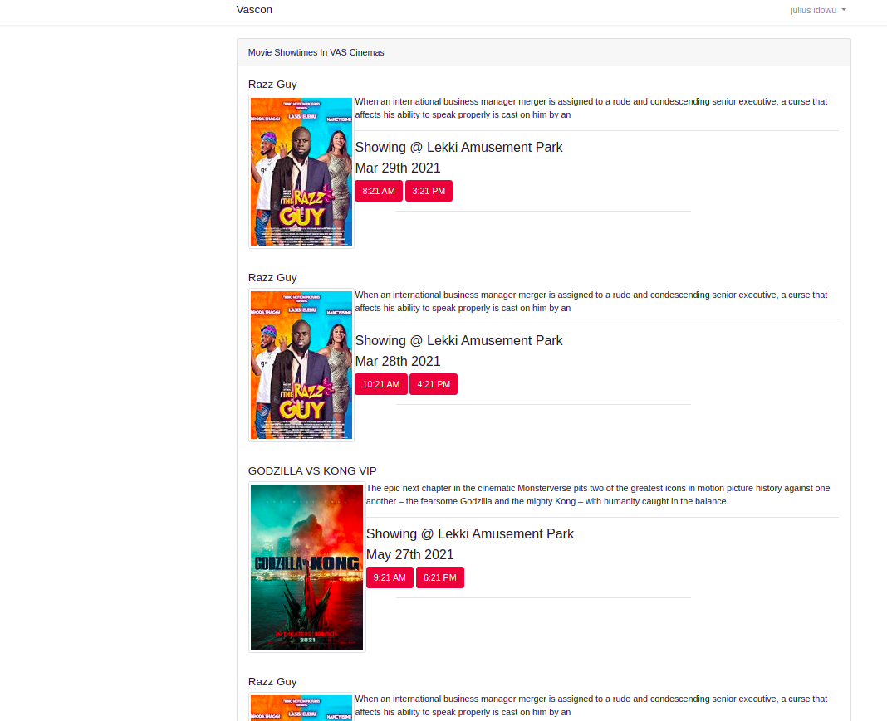

#  Laravel Modular Example


> ### Laravel Modular Example codebase that uses laravel repository pattern samples).

This repo is a work in progress — PRs and issues welcome! 

----------




# Getting started

## Installation

Please check the official laravel installation guide for server requirements before you start. [Official Documentation](https://laravel.com/docs/8.x/installation#installation)

Alternative installation is possible without local dependencies relying on [Docker](#docker) and made eaiser with [Laravel Sail](https://laravel.com/docs/8.x/sail)

Clone the repository

    git clone https://github.com/JuliRash/modular-laravel-example.git

Switch to the repo folder

    cd modular-laravel-example.git

Install all the dependencies using composer

    composer install

Copy the example env file and make the required configuration changes in the .env file

    cp .env.example .env

Generate a new application key

    php artisan key:generate


Run the database migrations with seed data(**Set the database connection in .env before migrating**)

    php artisan migrate --seed

Start the local development server

    php artisan serve

You can now access the server at http://localhost:8000

**TL;DR command list**

    git clone git clone https://github.com/JuliRash/modular-laravel-example.git
    cd modular-laravel-example.git
    composer install
    cp .env.example .env
    php artisan key:generate
    
**Make sure you set the correct database connection information before running the migrations** [Environment variables](#environment-variables)

    php artisan migrate
    php artisan serve

## Database seeding

**Populate the database with seed data with relationships which includes users, showtimes, movies, cinemas. This can help you to quickly start testing.**

Run the database seeder and you're done

    php artisan db:seed

***Note*** : It's recommended to have a clean database before seeding. You can refresh your migrations at any point to clean the database by running the following command

    php artisan migrate:refresh
    
## Laravel Sail

To install with Sail you must have docker installed [Docker](https://www.docker.com), run following commands:

```
git clone git clone https://github.com/JuliRash/modular-laravel-example.git
cd modular-laravel-example
cp .env.example.docker .env
./vendor/bin/sail  up
./vendor/bin/sail artisan migrate --seed
```

The application can be accessed at  [http://localhost:8000/](http://localhost:8000/). if you installed manually

If you used sail to install the application you can access the application here. [http://localhost](http://localhost)

---------

# Code overview

## Dependencies

- [laravel-modules](https://github.com/nWidart/laravel-modules) - Form managing large laravel applications using modules like a laravel package.

## Folders

- `Modules` - Contains all the Modules of the application.

## Environment variables

- `.env` - Environment variables can be set in this file

# Example Login
 - If your installation is successful with the seed dara you can use the this login below

 username: admin@vascon
 password: vascon

 --------

***Note*** : You can quickly set the database information and other variables in this file and have the application fully working.

----------